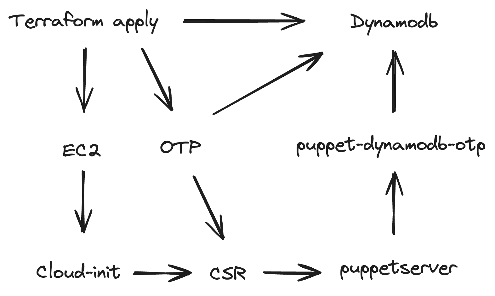

# puppet-dynamodb-otp


`puppet-dynamodb-otp` is a CLI tool designed to store and validate One-Time Passwords (OTPs) in AWS DynamoDB for Puppet certificate autosigning ceremonies.



## Overview

When Puppet agents register with the Puppet Primary Server, they can include a challenge password in their Certificate Signing Request (CSR). `puppet-dynamodb-otp` validates that challenge password against an active OTP stored in DynamoDB before autosigning the certificate.

## DynamoDB Table Setup

### Table Schema

Create a DynamoDB table with the following settings:

- **Table Name**: `puppet-dynamodb-otp` (configurable via `DYNAMODB_TABLE_NAME` env var or `--table-name` flag)
- **Partition Key**: `fqdn` (String)
- **TTL Attribute**: `expire_at_unix` (Number / Unix epoch timestamp)

### Attribute Mapping

| DynamoDB Attribute | Data Type | Description |
| :--- | :--- | :--- |
| `fqdn` | String (Key) | Fully Qualified Domain Name of the node |
| `token_table_item` | String | Generated OTP token string |
| `expire_at_unix` | Number | Expiration timestamp in Unix epoch seconds |

### Required IAM Policy

```json
{
  "Version": "2012-10-17",
  "Statement": [
    {
      "Effect": "Allow",
      "Action": [
        "dynamodb:GetItem",
        "dynamodb:PutItem",
        "dynamodb:DeleteItem",
        "dynamodb:Scan"
      ],
      "Resource": "arn:aws:dynamodb:*:*:table/puppet-dynamodb-otp"
    }
  ]
}
```

## Installation

### macOS (Homebrew)

```bash
brew tap attachmentgenie/tap
brew install attachmentgenie/tap/puppet-dynamodb-otp
```

### From Source

```bash
go build -o puppet-dynamodb-otp main.go
```

## Usage

### Create an OTP Token

```bash
# Create token for node.example.com with 300s TTL (default)
puppet-dynamodb-otp create node.example.com --ttl 300

# Custom table name
puppet-dynamodb-otp create node.example.com --table-name my-custom-table
```

### List Active OTP Tokens

```bash
# List all active tokens
puppet-dynamodb-otp list

# View token for a specific FQDN
puppet-dynamodb-otp list node.example.com
```

### Delete an OTP Token

```bash
puppet-dynamodb-otp delete node.example.com
```

### Validate a CSR (Puppet Policy Executable)

Pass the PEM-encoded CSR via STDIN to validate against DynamoDB:

```bash
puppet-dynamodb-otp validate-csr node.example.com < /path/to/node.csr
```

### Puppet `autosign.conf` / Policy Executable Setup

In `/etc/puppetlabs/puppet/puppet.conf`:

```ini
[master]
autosign = /usr/local/bin/puppet-dynamodb-otp
```

Puppet passes the node's FQDN as `$1` and writes the CSR PEM to STDIN. `puppet-dynamodb-otp` automatically defaults to the `validate-csr` action when invoked directly by Puppet.

## Configuration

| Environment Variable | CLI Flag | Default | Description |
| :--- | :--- | :--- | :--- |
| `DYNAMODB_TABLE_NAME` | `--table-name`, `-t` | `puppet-dynamodb-otp` | Target AWS DynamoDB table name |
| `AWS_REGION` | -- | (AWS SDK default) | Target AWS region |

## License

Apache License 2.0. See [LICENSE](LICENSE) for details.
